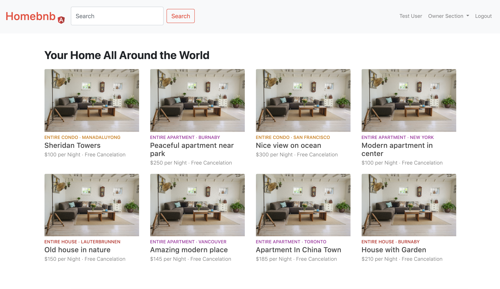
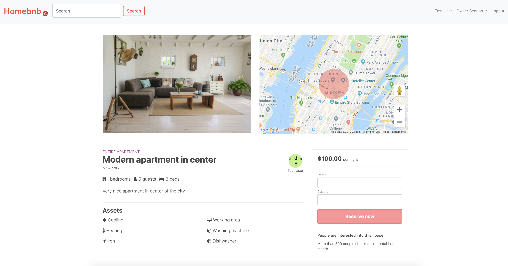

# Park Discovery
> A fictional full stack web application using MEAN stack (MongoDB, Express, Angular, Node) that provides functions and services similar to the popular airbnb.com. It is inspired from the Udemy course - [Angular 6 (Angular 2+) & React 16 - The Complete App Guide by Filip Jerga](https://www.udemy.com/practical-angular-react-node-airbnb-style-application/)





## Live Demo

To see the app in action, go to [https://angular-bnb.herokuapp.com](https://angular-bnb.herokuapp.com)

**This website is not intended for public use. Please note that all rental information are randomly generated and some of the data maybe fake.**

## Features

* Authentication using JWT:
  
  * User login with username and password

  * User registration

* Authorization:

  * One cannot edit or delete rentals created by other users without being authenticated

* Manage rental and bookings with basic functionalities:

  * Create, show, edit and delete rentals and reviews

  * Display rental location on Google Maps
  
  * Create and show rental bookings
  
* Upload rentals photos using Amazon S3

* Payment feature using Stripe

* Flash messages responding to users' interaction with the app

* Responsive web design

## Getting Started

> This app contains API secrets and passwords that have been hidden deliberately, so the app cannot be run with its features on your local machine. However, feel free to clone this repository if necessary.

### Clone or download this repository

```sh
 clone https://github.com/AceNavarro/AngularBnB.git
```

### Install dependencies

```sh
npm install
```

or

```sh
yarn install
```

## Built with

### Front-end

* HTML5
* CSS3
* [Angular 7](https://angular.io)
* [Google Maps APIs](https://developers.google.com/maps/)
* [Bootstrap](https://getbootstrap.com)
* [Angular Datepicker](https://github.com/fragaria/angular-daterangepicker)
* [Toastr](https://www.npmjs.com/package/ngx-toastr)

### Back-end

* [node](https://nodejs.org/en/)
* [express](https://expressjs.com/)
* [RESTful routing](https://codepen.io/urketadic/details/oZRdRN)
* [mongoDB](https://www.mongodb.com/)
* [mongoose](http://mongoosejs.com/)
* [moment](https://momentjs.com/)

### Platforms

* [Heroku](https://www.heroku.com/)
* [mLab](https://mlab.com/home)
## License

#### [MIT](./LICENSE)
